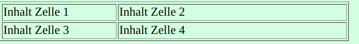

# Vokabular

---

<!--toc:start-->

-   [Vokabular](#vokabular)
    -   [HTML](#html)
    -   [CSS](#css)
    -   [JS](#js)
    <!--toc:end-->

## HTML

-   **HTML**

    -   Hyper Text Markup Language

-   `<Befehl-Start>` `</Befehl-Stop>`

```html
<!DOCTYPE html>
<html lang="en">
    <head>
        <meta charset="UTF-8" />
        <title>Hello, World!</title>
    </head>

    <body>
        <h1>Hello, World!</h1>
    </body>
</html>
```

-   `<h1>Text</h1>`

    -   Schreibt einen Titel aus, h1, h2, h3
    -   Die Zahlen Stehen für die Grösse
    -   Heading

-   `<!-- Kommentar -->`

    -   Ist ein Text Kommentar

-   `<p> Neue Zeile </p>`

    -   Neue Zeile für Text Generieren
    -   Paragraph

-   `<h1 style="text-align: center">Text</h1>`

    -   Titel h1 Zentriert
    -   Möglichkeiten
        -   left
        -   right
        -   center

-   `<b>fett</b>`

    -   Der Text wird Fett geschrieben

-   `<i>kursiv</i>`

    -   Der Text wird Kursiv geschrieben

-   `<br>`

    -   Absatz
    -   "Enter"

-   `<body style="background: red">`

    -   Hintergrundfarbe rot

-   `<span style="color: #FF0000; "> Hallo, ich bin ein roter Text</span>`

    -   Roter Text als HEX Code

-   `<a href="https://example.com">Linkname</a>`

    -   Link auf ein anderes HTML Dokument oder Webseite

-   `<link rel="icon" href="Ordnername/icon.png>`

    -   Favicon im Tab anzeigen

-   ``
    -   Relativer Pfad angeben/ Bild einfügen/ Breite und Höhe in pixel/ lokaler Ort

```html
<table border="1">
    <colgroup>
        <col width="150" />
        <!-- Spaltenbreite 1 150px -->
        <col width="300" />
        <!-- Spaltenbreite 2 300px -->
    </colgroup>
    <tr>
        <td>Inhalt Zelle 1</td>
        <td>Inhalt Zelle 2</td>
    </tr>
    <tr>
        <td>Inhalt Zelle 3</td>
        <td>Inhalt Zelle 4</td>
    </tr>
</table>
```



-   `<tr> </tr>`

    -   Zeile erzeugen

-   `<td> </td>`
    -   Spalte erzeugen

```html
<h2>Listenüberschrift</h2>
<ul>
    <!-- Starte eine unordered-list -->
    <li>Punkt 1</li>
    <li>Punkt 2</li>
    <li>Punkt 3</li>
</ul>
```

```html
<ol type="I">
    <!-- Starte eine ordered list mit grossen römischen Zahlen -->
    <li>Punkt 1</li>
    <li>Punkt 2</li>
    <li>Punkt 3</li>
</ol>
```

- ``
  - Ein Bild anzeigen lassen, Grösse definieren, Bild als Map definieren

```html

<map name="map_1">
    <area
        shape="rect"
        coords="0,0,450,330"
        href="download/herzige_mathe.jpg"
        download="Hier gelangst du zu der herzigen Mathematik"
        alt="Mathe"
    />
</map>
```
- Bild und Map  
  - Ein Bild anzeigen lassen, Grösse definieren, Bild als Map definieren
  - Map anlegen, Form Festlegen
  - Download datei festlegen
  - Download namen festlegen

## CSS

-   **CSS**
    -   Cascading Style Sheets

## JS

-   **JS**
    -   JavaScript
